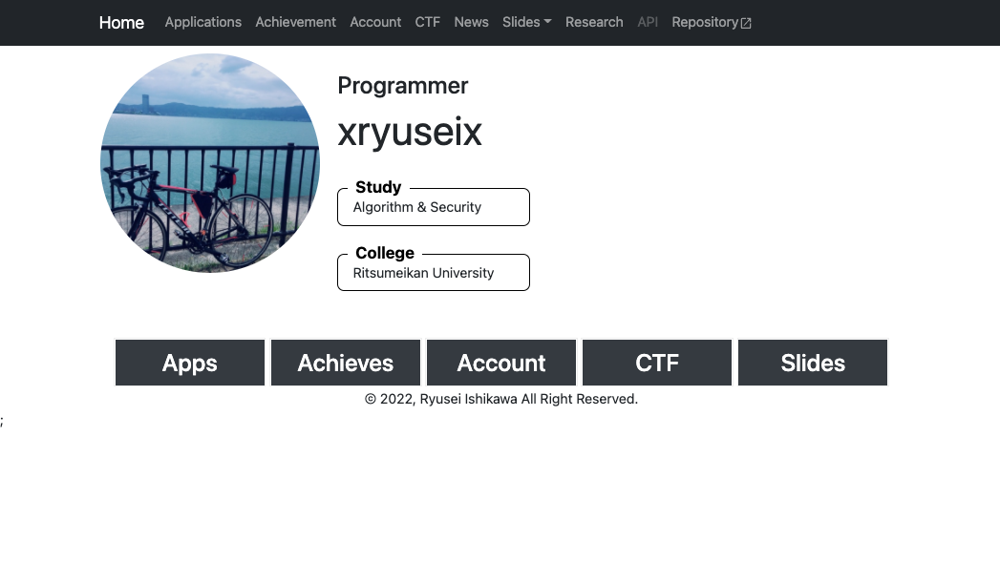

# Next.jsに移行しました

サイトので使用しているフレームワークをGatsby.jsからNext.jsに移行しました

* これが旧
  * 
* これが新
  * 

理由としては以下の通りです．

* Gatsby.jsは同じページを生成するのにサイトの構成がやや複雑だった
* 今後静的サイトでWebAPIを作りたい関係で，Next.jsを使った方がやや楽な気がする
* Gatsby.jsビルド時間が遅かった(今後早くなるらしいが)
* 今回最低限必要な要件としては
  * React+TypeScriptが使えて移行が楽
  * 静的サイトを生成できる
  * MarkdownをHTMLに変換する機能がある
  * 動的ページを作成できる
  * ディレクトリ内のコンテンツ一覧を表示するHTMLを生成できる(News一覧機能など)
* あたりだったので，これができるフレームワークとしてNext.jsを選びました

今回変わった点は以下の通りです．

* サイト全体のフォントが変わった
* [slidesページ](https://xryuseix.github.io/slides)でスライドを指定する際はクエリパラメータからパスパラメータに変更
* Markdownパーサの生成後の`HTML`のデザインを変更
* [Newsページ](https://xryuseix.github.io/news)でNews一覧機のデザインを変更
* ナビゲーションバーにResearch, APIボタンを追加
* その他，見た目が悪くなってたところを修正

コードブロックはこんな感じに↓

```ts
import React from 'react';
import { render } from 'react-dom';
```